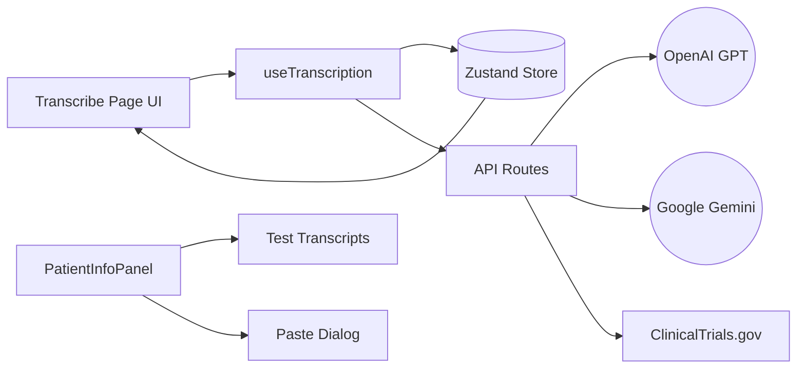
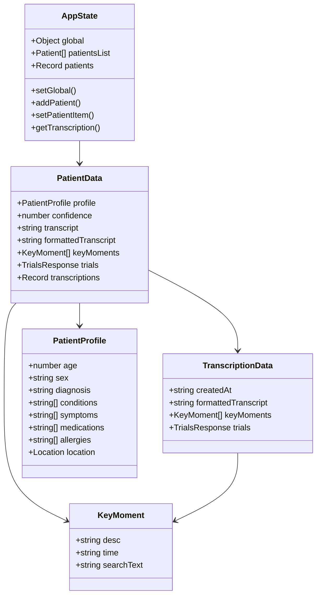
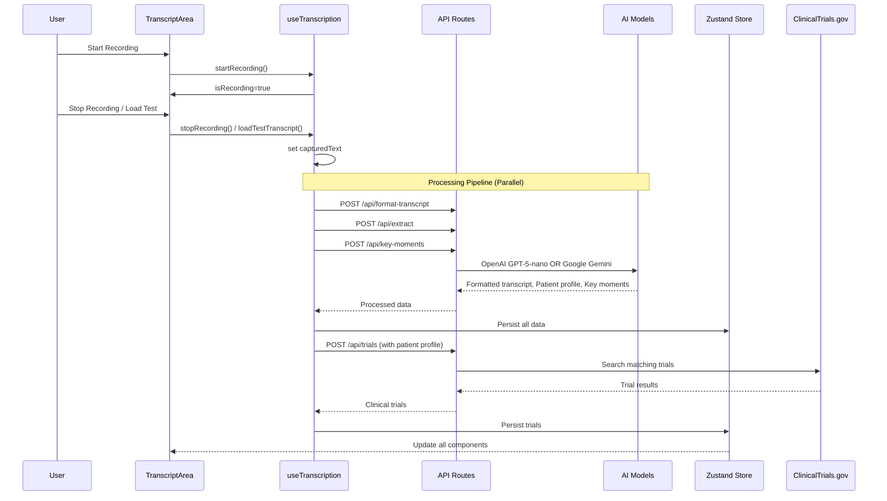
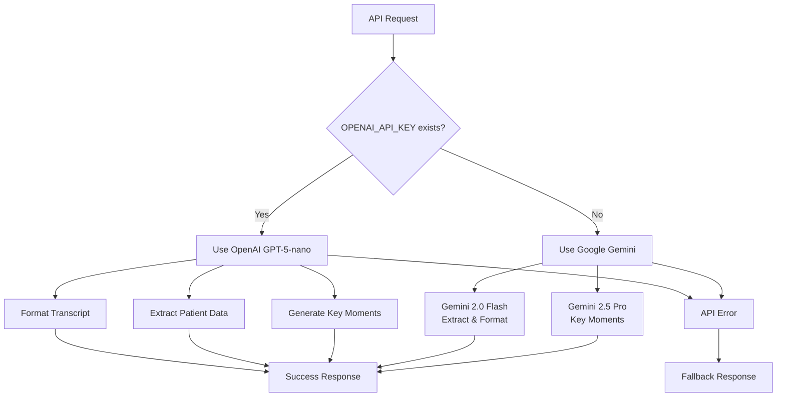
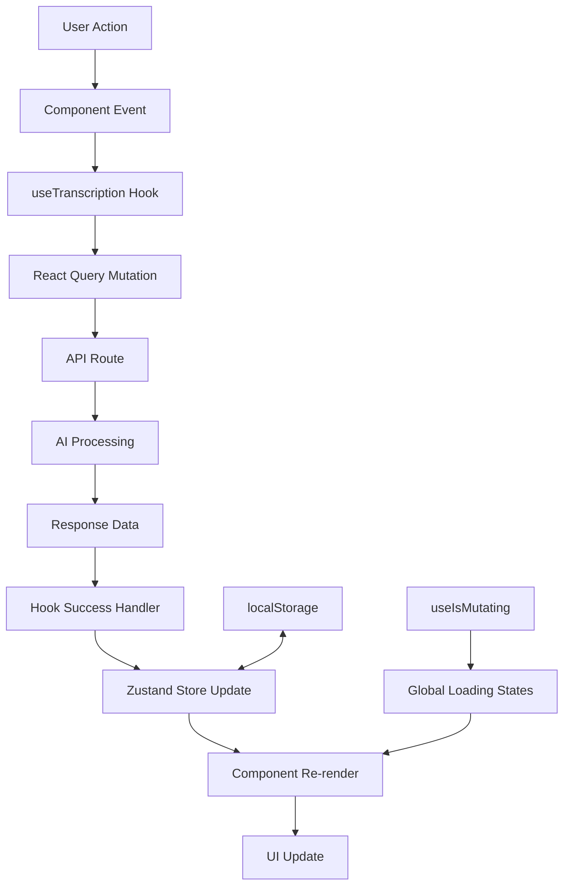

# DeeperScribe Architecture

This document explains how the DeeperScribe Clinical Trials Matcher works end-to-end: data flow, state management, components, APIs, and AI integration. It includes diagrams and notes on the responsibilities of each module.

## High-level Overview



**Key Architecture Principles:**
- **Client-Side Rendering (CSR)**: Full CSR implementation to avoid hydration issues
- **AI Model Fallback**: Automatic fallback from OpenAI to Google Gemini when API keys are unavailable
- **Real-time Processing**: Live transcription with browser speech recognition + AI enhancement
- **Persistent State**: Zustand store with localStorage persistence across sessions
- **Component Composition**: Modular component architecture with shadcn/ui design system

## Data Model



**Key Design Decisions:**
- **Dual-level Storage**: Patient-level fields for quick access + transcription-level for multiple trial sets
- **Nullable Fields**: AI models can omit fields they can't extract with confidence
- **Persistent State**: All data survives browser refresh via localStorage
- **Type Safety**: Full TypeScript with Zod schema validation

## Recording and Processing Pipeline



## AI Model Integration & Fallback Strategy



**AI Model Usage:**
- **OpenAI (Primary)**: `gpt-5-nano` for all text processing tasks
- **Google Gemini (Fallback)**: 
  - `gemini-2.0-flash-exp` for extraction and formatting
  - `gemini-2.5-pro` for key moments generation
- **Whisper**: Audio transcription (when available)
- **Browser Speech Recognition**: Fallback for real-time transcription

## Core Modules

### `hooks/useTranscription.ts`
**Central orchestration layer** that manages:
- **Recording State**: Browser speech recognition integration
- **Processing Pipeline**: Coordinates all API calls with React Query
- **Global State Sync**: Uses `useIsMutating` for cross-component loading states
- **Data Persistence**: Automatic saving to Zustand store
- **Error Handling**: Graceful degradation and user feedback

Key features:
- `loadTestTranscript()` for predefined test scenarios
- `isBusy` derived from global mutation states
- Automatic processing triggers after recording/loading

### `lib/store.ts`
**Zustand store with localStorage persistence**:
- **Storage Key**: `deeperscribe` (persisted across sessions)
- **Patient Management**: CRUD operations for patients and transcriptions
- **Nested Data**: Support for multiple transcription sets per patient
- **Type Safety**: Full TypeScript integration with proper typing

### `hooks/usePatientManager.ts`
**Patient data management utilities**:
- Patient CRUD operations
- Status derivation (trial counts, processing states)
- Display name formatting
- Integration with main store

### `lib/constants.ts`
**Application constants and test data**:
- **Test Transcripts**: 3 predefined medical scenarios (breast cancer, diabetes, COPD)
- **Diagnosis Keywords**: Expanded medical condition mapping for trial matching
- **Storage Keys**: Centralized key management
- **Utility Functions**: `generateTestTranscript()`, `simplifyDiagnosis()`

## API Routes

### `/api/format-transcript`
**Transforms raw speech into structured dialogue**
- **Input**: Raw transcript string
- **AI Model**: GPT-5-nano or Gemini 2.0 Flash
- **Output**: Formatted speaker turns with proper punctuation
- **Fallback**: Returns original transcript if AI fails

### `/api/extract`
**Extracts structured patient data from transcript**
- **Input**: Formatted transcript
- **AI Model**: GPT-5-nano or Gemini 2.0 Flash
- **Schema**: `PatientProfileSchema` (age, sex, diagnosis, conditions, etc.)
- **Output**: Patient profile + confidence score
- **Features**: Conservative extraction, medical terminology

### `/api/key-moments`
**Generates clinically relevant key moments**
- **Input**: Transcript + optional duration
- **AI Model**: GPT-5-nano or Gemini 2.5 Pro
- **Output**: 5-10 key moments with descriptions, quotes, timestamps
- **Features**: 
  - Timestamp approximation based on quote position
  - Schema validation with fallback handling
  - Focus on clinical relevance

### `/api/trials`
**Fetches matching clinical trials from ClinicalTrials.gov**
- **Input**: Patient profile + search parameters
- **External API**: ClinicalTrials.gov v2 API
- **Features**:
  - Smart query building (primary condition + additional terms)
  - NCT ID validation and filtering
  - Real-time data (no mocking)
  - Error handling for API limitations

### `/api/transcribe`
**Audio transcription via OpenAI Whisper**
- **Input**: Audio file (FormData)
- **AI Model**: Whisper-1
- **Output**: Transcribed text
- **Fallback**: Browser speech recognition for real-time

## Component Architecture

```mermaid
graph TD
  A[app/layout.tsx<br/>Root Layout] --> B[app/patient/[id]/transcribe/page.tsx<br/>Main Transcribe Page]
  
  B --> C[TranscriptArea<br/>Main transcript interface]
  B --> D[PatientInfoPanel<br/>Patient info & controls]
  B --> E[KeyMoments<br/>Clinical key moments]
  B --> F[TranscribePageHeader<br/>Page header]
  
  C --> C1[TranscriptionControls<br/>Record/stop buttons]
  C --> C2[TranscriptDisplay<br/>Formatted transcript view]
  C --> C3[TranscriptBottomArea<br/>Action buttons]
  
  D --> D1[Test Transcript Dropdown<br/>Predefined scenarios]
  D --> D2[Paste Dialog<br/>Custom transcript input]
  D --> D3[Clinical Trials Button<br/>Navigate to results]
  
  E --> E1[Loading Skeletons<br/>Enhanced loading states]
  E --> E2[Moment Buttons<br/>Clickable highlights]
```

### Key Component Features

**TranscriptArea**:
- **Blur Effect**: Background dimming during processing
- **Centered Loading**: Non-blocking processing overlay
- **Highlight Integration**: Text highlighting from key moments
- **Responsive Scrolling**: Independent scroll areas

**PatientInfoPanel**:
- **Dropdown Menu**: shadcn/ui dropdown with test transcript options
- **Paste Dialog**: Full-featured dialog for custom transcript input
- **Clipboard Integration**: One-click paste from system clipboard
- **Status Indicators**: Real-time processing feedback

**KeyMoments**:
- **Enhanced Loading**: Realistic skeleton animations with pulsing indicators
- **Interactive Highlights**: Click to highlight text in transcript
- **Regeneration Support**: Individual moment loading states
- **Empty States**: Helpful guidance when no moments exist

## UI/UX Design System

**shadcn/ui Components**:
- `Button`, `Dialog`, `DropdownMenu`, `Textarea`
- `Card`, `Skeleton`, `Alert`, `Loading`
- Consistent styling with Tailwind CSS
- Full accessibility support via Radix UI

**Loading States**:
- **Global State Tracking**: `useIsMutating` for cross-component awareness
- **Skeleton Animations**: Realistic loading placeholders
- **Processing Overlays**: Non-blocking status indicators
- **Blur Effects**: Visual feedback during processing

**Responsive Design**:
- Mobile-first approach
- Independent scrolling areas
- Flexible layout with CSS Grid/Flexbox
- Touch-friendly interactions

## State Management & Data Flow



**Key Patterns**:
- **Optimistic Updates**: Immediate UI feedback before API completion
- **Global Loading States**: Shared loading indicators across components
- **Persistent State**: Automatic localStorage sync
- **Error Boundaries**: Graceful error handling and recovery

## Testing & Development Features

**Test Transcripts**:
- **Breast Cancer**: Female patient with family history
- **Diabetes**: Male patient with elevated blood sugar
- **COPD**: Male patient with respiratory symptoms

**Development Tools**:
- **TypeScript**: Full type safety
- **Zod Schemas**: Runtime validation
- **React Query DevTools**: API debugging
- **Next.js DevTools**: Performance monitoring

## Performance Optimizations

- **Code Splitting**: Dynamic imports for large components
- **React Query Caching**: Intelligent API response caching
- **Zustand Persistence**: Efficient localStorage operations
- **Parallel Processing**: Concurrent API calls where possible
- **Skeleton Loading**: Perceived performance improvements

## Security & Privacy

- **Client-Side Only**: No server-side data storage
- **API Key Management**: Environment variable protection
- **Input Validation**: Zod schema validation on all inputs
- **Error Sanitization**: No sensitive data in error messages

---

## Development Guidelines

### Adding New Features
1. **Define Schemas**: Create Zod schemas for new data types
2. **Update Store**: Add necessary state management
3. **Create Hooks**: Centralize logic in custom hooks
4. **Build Components**: Use shadcn/ui for consistency
5. **Add API Routes**: Follow existing patterns
6. **Test Integration**: Use test transcripts for validation

### Debugging
- **React Query DevTools**: Monitor API calls and caching
- **Zustand DevTools**: Inspect state changes
- **Browser DevTools**: Check localStorage persistence
- **Network Tab**: Verify API requests and responses

### Performance Monitoring
- **Next.js Analytics**: Built-in performance metrics
- **React Profiler**: Component render optimization
- **Lighthouse**: Web vitals and accessibility

---

*For detailed implementation examples, see the individual component files and their top-of-file comments.*