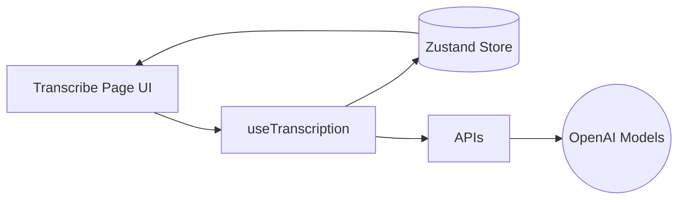
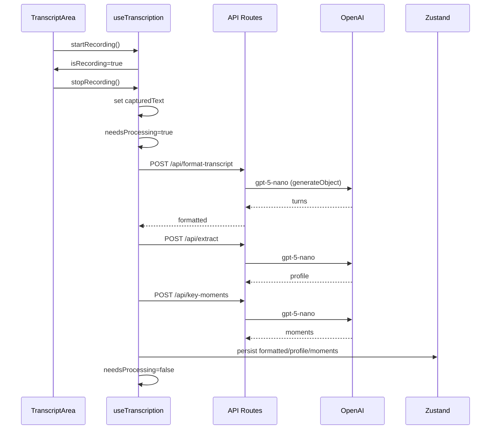
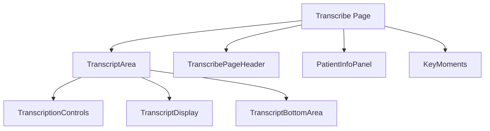

# DeeperScribe Architecture

This document explains how the app works end-to-end: data flow, state, components, and APIs. It includes diagrams and notes on the responsibilities of each module.

## High-level Overview



- UI is rendered by Next.js (App Router) with client components.
- `useTranscription` is the central orchestration layer for recording, processing, and persistence.
- Zustand store persists patient and transcription data to `localStorage` (key: `deeperscribe`).
- API routes under `app/api/*` call OpenAI (via Vercel AI SDK) for formatting, extracting patient profile, key moments, and transcriptions.

## Data Model (simplified)

```mermaid
classDiagram
  class AppState {
    global: { doctorName, nameVisibility }
    patientsList: Patient[]
    patients: Record<patientId, PatientData>
  }
  class PatientData {
    transcript?: string
    formattedTranscript?: string
    keyMoments?: KeyMoment[]
    profile?: PatientProfile
    confidence?: number
    transcriptions?: Record<txId, TranscriptionData>
  }
  class TranscriptionData {
    createdAt: string
    formattedTranscript?: string
    keyMoments?: KeyMoment[]
    trials?: TrialsResponse
  }
```

Key points:
- Patient-level fields provide quick access and backwards compatibility.
- Transcription-level fields allow multiple trial sets per patient.

## Recording and Processing Pipeline



## Core Modules

### `hooks/useTranscription.ts`
- Centralizes: recording state, processing pipeline, persistence to store, and derived helpers.
- Uses `needsProcessing` flag so APIs run only after explicit triggers (stop recording, load test).
- Syncs with store so multiple components update instantly without refresh.

### `lib/store.ts`
- Zustand store (persisted to `localStorage`).
- Patient-level and transcription-level shapes as above.

### API Routes
- `app/api/format-transcript`: Format raw transcript into speaker turns via `gpt-5-nano`.
- `app/api/extract`: Extracts patient profile (`PatientProfileSchema`) from transcript.
- `app/api/key-moments`: Produces key moments with optional timestamp approximation.
- `app/api/trials`: Fetches clinical trials from ClinicalTrials.gov using extracted profile.

## Component Structure



- `TranscriptArea` owns the transcript scroll region and a fixed-aligned bottom action area.
- `TranscriptDisplay` renders transcript and highlights; now reads data via hooks to avoid prop drilling.
- `KeyMoments` always shows; displays skeleton, empty-help, or moments.

## State and Highlighting
- Selected key moment sets a search term; `TranscriptDisplay` uses `highlightText()` to wrap matches in `<mark>`.
- `useAutoScroll` (from component utils) can scroll to first `<mark>` when the highlight changes.

## Error and Loading States
- Loading spinner and disabled UI while processing (`isBusy || isGeneratingKeyMoments`).
- Transcript area dims and becomes non-interactive during processing.

## Notes on Decisions
- Client-Side Rendering (CSR) throughout to avoid SSR hydration pitfalls.
- Minimal API error handling (console.error, 500) per requirements.
- Removed prop drilling where sensible; components consume hooks directly.

---

If you need a deeper look at any module, search for the file path in the repo and read top-of-file comments.


